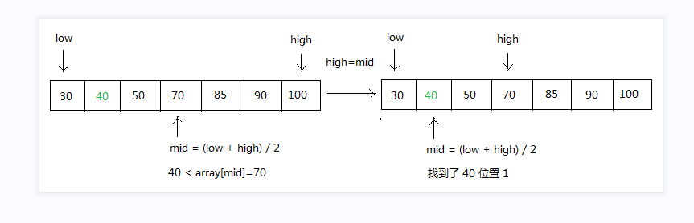

# 一. 二分折半查找
## 从一个已经排好序的数组中查找给定的值的索引位置
  
思路:  
1. 先初始化最低位 low=0, 最高位high=scores.length-1
2. 求出中间位 mid=(low+high)/2 的值 scores[mid]
3. 将中间位scores[mid]与searchValue比较
   如果scores[mid]==searchValue 说明找到了打印当前索引mid,
   如果scores[mid]<searchvalue 说明要找的value值="" 在mid+1到=""
   high="" 之间="" 如果scores[mid]>searchValue 说明要找的value值 在
   low 到 mid-1 之间
4. 依此类推 循环执行 3的步骤直到找到 searchValue 或者 没有找到
   low>=high 终止循环