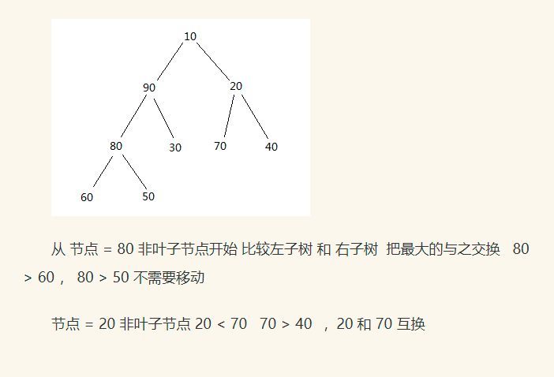
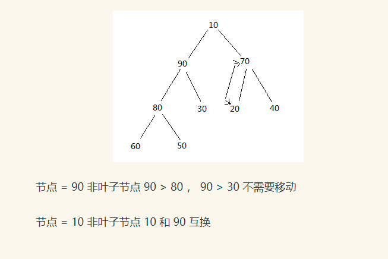
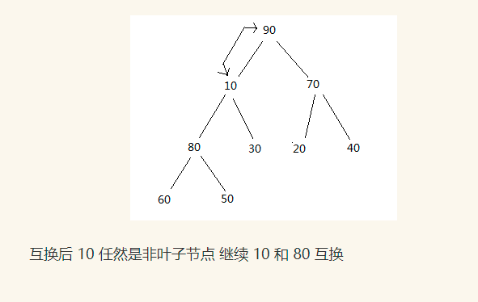
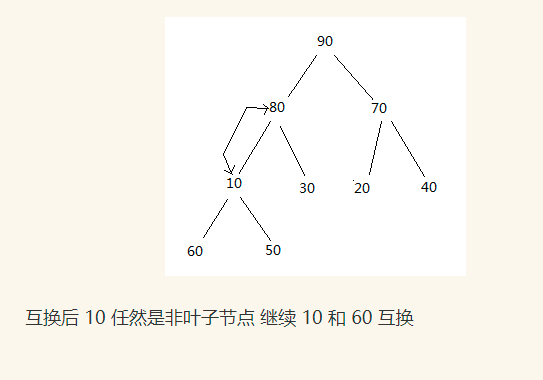
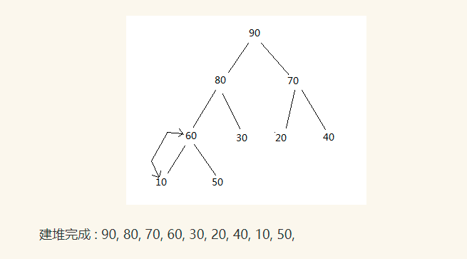
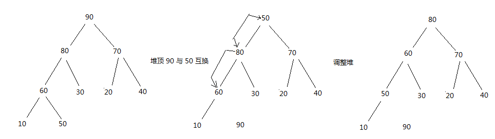
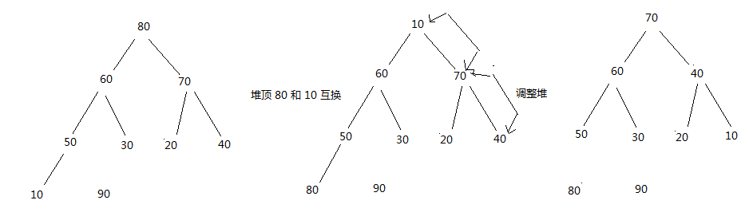
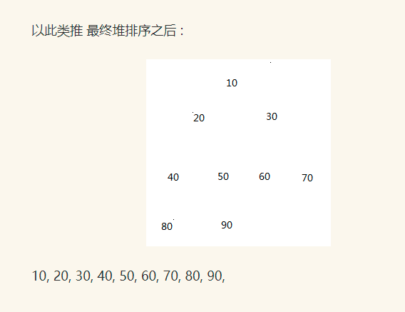

# 二叉堆排序

二叉堆: 完全二叉树中非终端结点的值均不大于（或不小于）其左、右孩子结点的值  
性质:

1. 小顶堆: ki <= k2i 且ki <= k2i+1
2. 大顶堆: ki >= k2i 且ki >= k2i+1
3. 父结点下标 = (i-1)/2
4. 左子结点下标 = 2*i+1
5. 右子结点下标 = 2*i+2  
例如: 10, 90, 20, 80, 30, 70, 40, 60, 50 建立堆如以下所示:  
   
   
   
   
   
   
开始对90, 80, 70, 60, 30, 20, 40, 10, 50进行堆排序  
堆顶元素90和尾50交换后-->调整堆

堆顶元素80和尾10交换后-->调整堆

