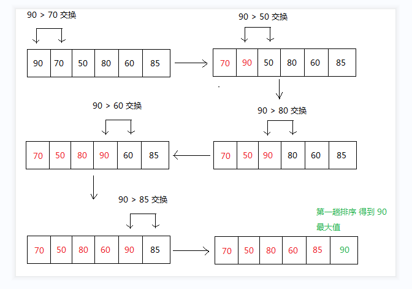

#一. 冒泡排序算法
n个元素，前后两个元素比较大小，如果前面元素大于后面元素，则交换位
置，直到排序完成  
图形分解如以下所示:      
  
TestBubbleSort.java与TestBubbleSort2.java是无优化的冒泡排序算法，由这两个文件可知与上图图解可知:   
第1趟排序后结果 : 70,50,80,60,85,90,  
第2趟排序后结果 : 50,70,60,80,85,90,  
第3趟排序后结果 : 50,60,70,80,85,90,  
第4趟排序后结果 : 50,60,70,80,85,90,  
第5趟排序后结果 : 50,60,70,80,85,90,  
可知第三次排序已经结束了，不必在进行第四，五次排序  
#二. 冒泡排序算法优化
##1. 优化比较排序趟数
TestBubbleSort2S.java与TestBubbleSort2Y.java可知  
第1趟排序后结果 : 70,50,80,60,85,90, 比较次数 : 5  
第2趟排序后结果 : 50,70,60,80,85,90, 比较次数 : 5  
第3趟排序后结果 : 50,60,70,80,85,90, 比较次数 : 5  
##2. 优化比较排序的交换比较次数
TestBubbleSortYs.java是优化了比较次数: 核心含义就是比较了5次后下一次必定少一次，缺点就是至少多1次排序   
第1趟排序后结果 : 70,50,80,60,85,90, 比较次数 : 5  
第2趟排序后结果 : 50,70,60,80,85,90, 比较次数 : 4  
第3趟排序后结果 : 50,60,70,80,85,90, 比较次数 : 3  
TestBubbleSortLocal.java是优化了比较次数中的最后索引位置，以减少最终的比较次数  
第1趟排序后结果 : 70,50,80,60,85,90, 比较次数 : 5  
第2趟排序后结果 : 50,70,60,80,85,90, 比较次数 : 4  
第3趟排序后结果 : 50,60,70,80,85,90, 比较次数 : 2