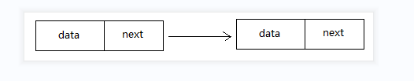

# 单链表
## 线性表的一种链式存储结构，由节点单向串连起来，每个节点由数据data和指向下一个节点的next组成
  
声明一个单链表：data/next→data/next
```
public class Node {
private String data;//节点数据
private Node next;//下一个节点

    public Node(String data, Node next) {
        this.data = data;
        this.next = next;
    }

    public String getData() {
        return data;
    }

    public void setData(String data) {
        this.data = data;
    }

    public Node getNext() {
        return next;
    }

    public void setNext(Node next) {
        this.next = next;
    }
}
```
单链表操作类：TestSingleLink.java