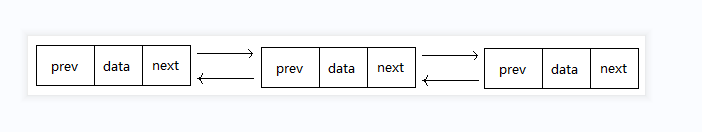

# 双链表
## 线性表的一种链式存储结构，由节点双向串连起来，每个节点由数据data，指向上一个节点prev指针 ,指向下一个节点next指针组成
  
声明一个双链表结构:  
```
class Node {
    private String data;//结点数据
    private Node prev;//上一个结点
    private Node next;//下一个几点

    public Node(String data, Node prev, Node next) {
        this.data = data;
        this.prev = prev;
        this.next = next;
    }

    public String getData() {
        return data;
    }

    public void setData(String data) {
        this.data = data;
    }

    public Node getPrev() {
        return prev;
    }

    public void setPrev(Node prev) {
        this.prev = prev;
    }

    public Node getNext() {
        return next;
    }

    public void setNext(Node next) {
        this.next = next;
    }
}
```
双链表操作类：TestDoubleLink.java