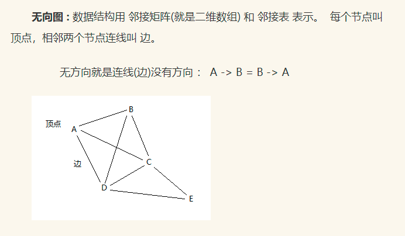

# 无向图广度优先搜索
  
邻接矩阵描述上图: 顶点总数为二维数组大小，有边的值为1没有边的值为0  
A B C D E  
A 0 1 1 1 0  
B 1 0 1 1 0  
C 1 1 0 1 1  
D 1 1 1 0 1  
E 0 0 1 1 0  
广度优先搜索:  
从A开始找到所有相邻边节点B,C,D然后再从B找到所有相邻节点A,C,D以此类推递归直到找到所有节点 A -> B -> C -> D -> E