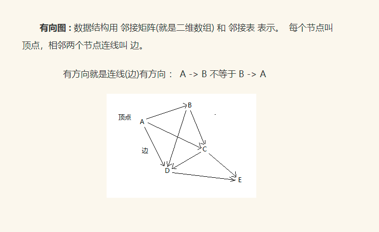

# 有向图广度优先搜索
  
邻接矩阵描述上图: 顶点总数为二维数组 大小，有边的值为1没有边的值为0  
A B C D E  
A 0 1 1 1 0  
B 0 0 1 1 0  
C 0 0 0 1 1  
D 0 0 0 0 1  
E 0 0 0 0 0  
广度优先搜索: 从 A 开始找到所有相邻边节点 B , C , D 然后再 从 B 找到所有相邻节点 A , C , D 以此类
推递归直到找到所有节点 A -> B -> C -> D -> E