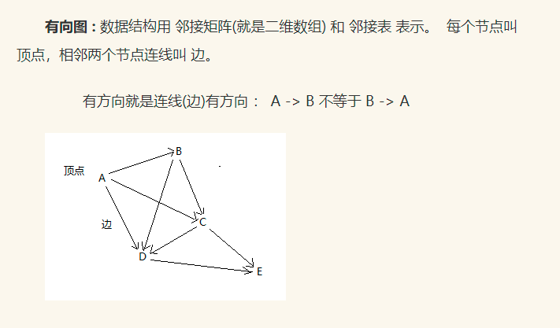

# 有向图深度优先搜索
  
邻接矩阵描述上图: 顶点总数为二维数组大小，有边的值为1没有边的值为0  
A B C D E  
A 0 1 1 1 0  
B 0 0 1 1 0  
C 0 0 0 1 1  
D 0 0 0 0 1  
E 0 0 0 0 0  
深度优先搜索: 从A开始找相邻边节点B,然后再从B找相邻节点C,以此类推递归直到找到所有节点
A -> B -> C -> D -> E