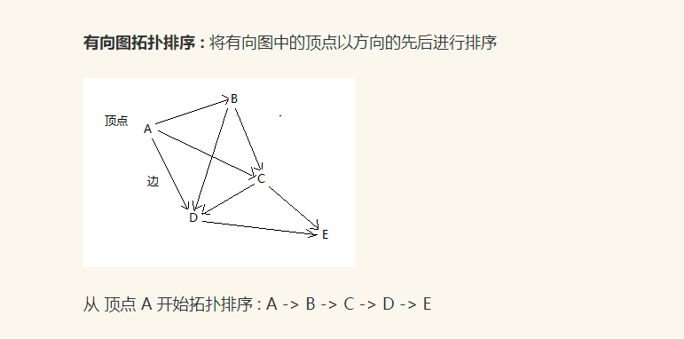
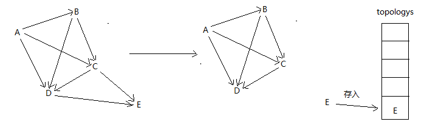
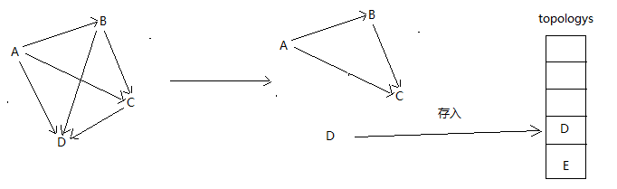
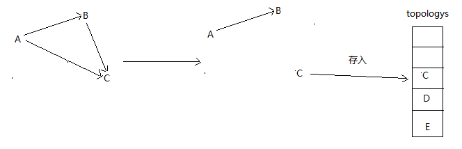
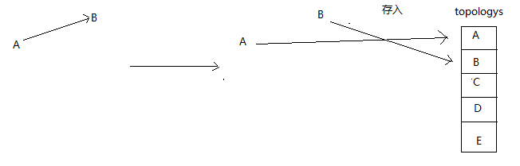

# 有向图拓扑排序
  
有向图拓扑排序图解分析过程:  
1.找到 无后续的顶点 E 然后存入 topologys 排序数组 最后 E 从图中删除
  
2.继续找到 无后续的顶点 D 然后存入 topologys 排序数组 最后 D 从图中删除
  
3.继续找到 无后续的顶点 C 然后存入 topologys 排序数组 最后 C 从图中删除
  
4.继续找到 无后续的顶点 B 和 A 然后存入 topologys 排序数组 以此类推排序完成
