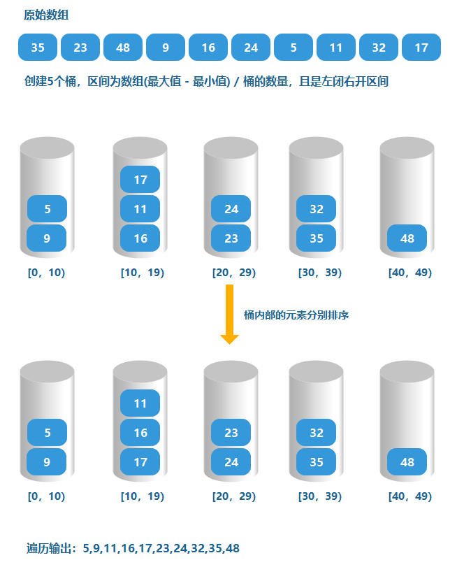

# 桶排序
桶排序 (Bucketsort)，是一个排序算法，工作的原理是将数组分到有限数量的桶子里，每个桶子再个别排序（有可能再使用别的排序算法或是以递归方式继续使用桶排序进行排序）  
桶排序是计数排序的升级，计数排序可以看成每个桶只存储相同元素，而桶排序每个桶存储一定范围的元素，通过函数的某种映射关系，将待排序数组中的元素映射到各个对应的桶中，对每个桶中的元素进行排序（有可能再使用别的排序算法或是以递归方式继续使用桶排序），最后将非空桶中的元素逐个放入原序列中
## 桶排序思想
桶排序的思想是，若待排序的记录的关键字在一个明显有限范围内时，可设计有限个有序桶，每个桶只能装与之对应的值，顺序输出各桶的值，将得到有序的序列。简单来说，在我们可以确定需要排列的数组的范围时，可以生成该数值范围内有限个桶去对应数组中的数，然后我们将扫描的数值放入匹配的桶里的行为，可以看作是分类，在分类完成后，我们需要依次按照桶的顺序输出桶内存放的数值，这样就完成了桶排序
## 图解
