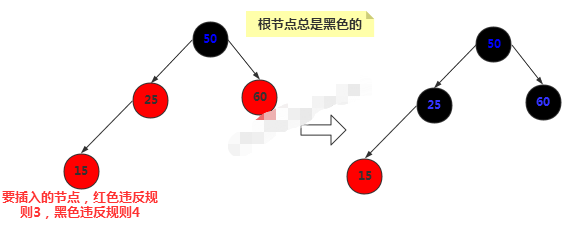
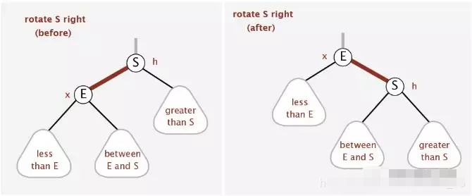
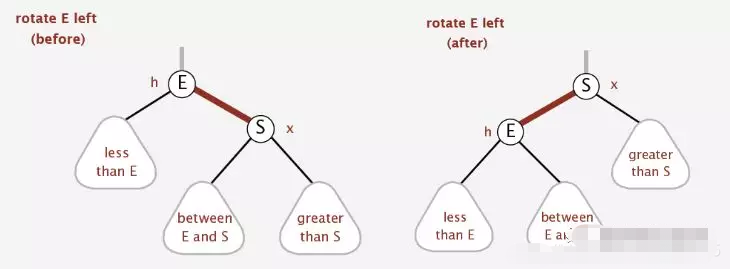

# 红黑树
## 简介
红黑树一种基于二叉搜索树，需要先看二叉搜索树的特征与性质，本篇MD参考: [CSDN博客-红黑树](https://blog.csdn.net/eson_15/article/details/51144079)
## 性质
1. 每个节点不是红色就是黑色
2. 根节点总是黑色
3. 如果节点是红色，则它的子节点必须是黑色（反之不一定）
4. 从根节点到叶节点或空子节点的每条路径，必须包含相同数目的黑色节点（即相同的黑色高度）
## 平衡性的修正
在红-黑树中插入的节点都是红色的，这不是偶然的，因为插入一个红色节点比插入一个黑色节点违背红-黑规则的可能性更小，插入黑色节点总会改变黑色高度（性质4），但是插入红色节点只有一半的机会会违背性质3，另外违背规则3比违背规则4要更容易修正
## 平衡的插入操作
如果是第一次插入，由于原树为空，所以只会违反红-黑树的性质2，所以只要把根节点涂黑即可。
如果插入节点的父节点是黑色的，那不会违背红-黑树的性质，什么也不需要做，但是遇到如下三种情况时，就需要考虑变色和旋转
1. 插入节点的父节点和其叔叔节点（祖父节点的另一个子节点）均为红色的
2. 插入节点的父节点是红色，叔叔节点是黑色，且插入节点是其父节点的右子节点
3. 插入节点的父节点是红色，叔叔节点是黑色，且插入节点是其父节点的左子节点
## 平衡性的自我修正
1. 改变节点的颜色: 保证性质3-4即可  
   
2. 右旋: 节点本身是不会旋转的，旋转改变的是节点之间的关系，选择一个节点作为旋转的顶端，如果做一次右旋，这个顶端节点会向下和向右移动到它右子节点的位置，它的左子节点会上移到它原来的位置。右旋的顶端节点必须要有左子节点  
   
3. 左旋: 左旋有右旋相似，但是左旋的顶端节点必须要有右子节点  
   
## 删除操作
1. 如果待删除的节点没有子节点，那么直接删除即可。
2. 如果待删除的节点只有一个子节点，那么直接删掉，并用其子节点去顶替它。
3. 如果待删除的节点有两个子节点，这种情况比较复杂。首先找出它的后继节点，然后处理“后继节点”和“被删除节点的父节点”之间的关系，最后处理“后继节点的子节点”和“被删除节点的子节点”之间的关系。

