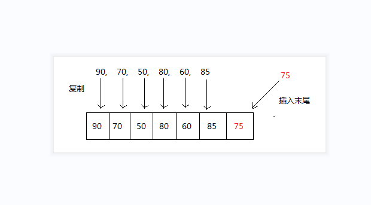
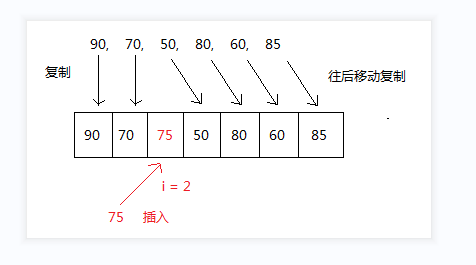
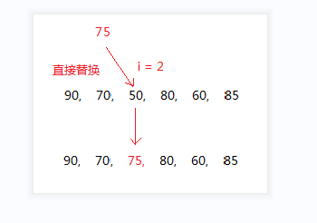

##一. Java线性表一维数组添加
###向一维数组scores末尾中添加一个学生的成绩75
  
思路:
1. 先创建一个比原来scores数组长度大1的临时数组 tempArray
2. 将scores数组的每一个值复制到 tempArray
3. 然后将 成绩为 75 赋值到 tempArray的新增最后的索引位置
4. 最后将tempArray地址指针引用赋值给 scores;  
源文件: TestArrayAdd.java  

##二. Java线性表一维数组插入
###向一维数组scores任意位置插入一个学生的成绩75
  
思路:
1. 先创建一个比原来scores数组长度大1的临时数组 tempArray
2. 将scores数组从开始到插入位置的前一个元素的每一个值复制到tempArray
3. 将scores数组从插入位置到最后的元素的每一个值往后移动一个复制到tempArray
3. 然后将 成绩为 75 赋值到 tempArray的要插入的索引位置
4. 最后将tempArray地址指针引用赋值给 scores;  
源文件: TestArrayInsert.java
   
##三. Java线性表一维数组更新
###向一维数组scores任意位置修改一个学生的成绩75
  
源文件: TestArrayUpdate.java

##四. Java线性表一维数组删除
###一维数组scores任意位置删除一个学生的成绩
  
思路:  
1. 创建一个临时比scores 小1的临时数组tempArray
2. 将删除位置前面的数据复制到tempArray前面
3. 将删除位置后面的数组依次复制到 tempArray 后面
4. 将tempArray地址指针引用赋值给 scores
5. 打印输出scores  
源文件: TestArrayDelete.java