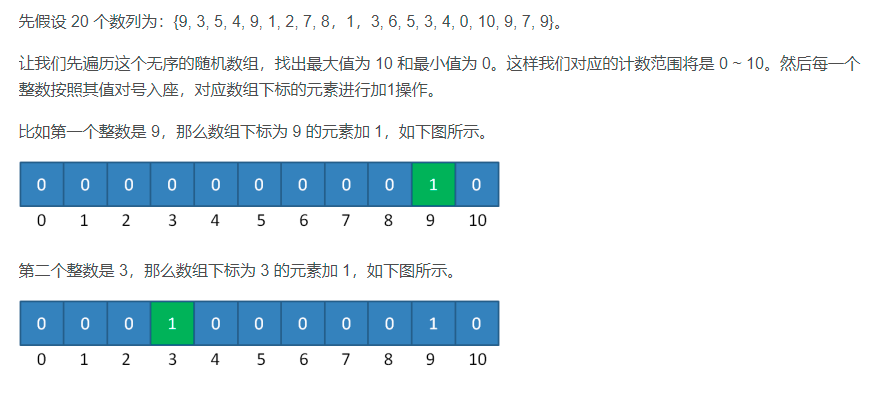
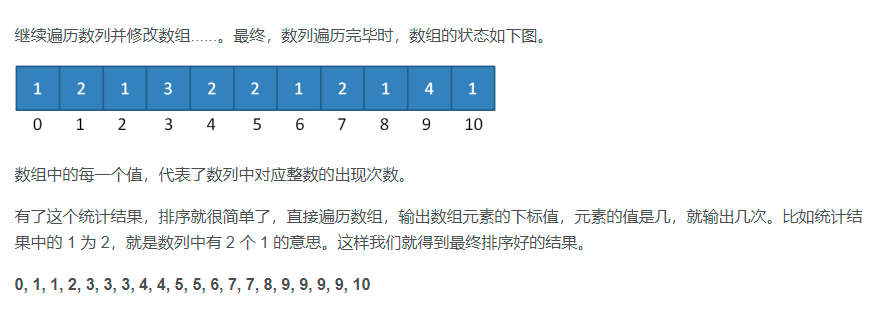

# 计数排序算法
计数排序是一个非基于比较的排序算法，元素从未排序状态变为已排序状态的过程，是由额外空间的辅助和元素本身的值决定  
参考: [CSDN博客-计数排序](https://blog.csdn.net/justidle/article/details/104203972)
## 算法过程与图解
1. 根据待排序集合中最大元素和最小元素的差值范围，申请额外空间
2. 遍历待排序集合，将每一个元素出现的次数记录到元素值对应的额外空间内
3. 对额外空间内数据进行计算，得出每一个元素的正确位置
4. 将待排序集合每一个元素移动到计算得出的正确位置上  
  

## 局限性
1. 当数列最大最小值差距过大时，并不适用于计数排序。比如给定 20 个随机整数，范围在 0 到 1 亿之间，此时如果使用计数排序的话，就需要创建长度为 1 亿的数组，不但严重浪费了空间，而且时间复杂度也随之升高。
2. 当数列元素不是整数时，并不适用于计数排序。如果数列中的元素都是小数，比如 3.1415，或是 0.00000001 这样子，则无法创建对应的统计数组，这样显然无法进行计数排序。正是由于这两大局限性，才使得计数排序不像快速排序、归并排序那样被人们广泛适用
