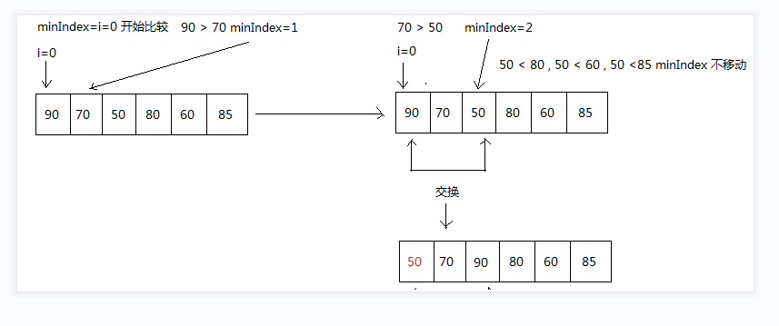

#一. 选择排序算法
## 将数组中剩下的没有排序的元素中选出最小的一个，插入已经排序的后面  
  
TestSelectSort.java和TestSelectSortResultSeccond.java可得:  
第1趟排序后结果 : 50,70,90,80,60,85, 比较次数 : 5  
第2趟排序后结果 : 50,60,90,80,70,85, 比较次数 : 4  
第3趟排序后结果 : 50,60,70,80,90,85, 比较次数 : 3  
第4趟排序后结果 : 50,60,70,80,90,85, 比较次数 : 2  
第5趟排序后结果 : 50,60,70,80,85,90, 比较次数 : 1  
#二. 选择排序算法优化
## 每次选择最小值的同时也可以选出最大值，双向排序，减少排序趟数  
核心原理: 设置两个临时索引排序下标分别分配到左右端进行排序  
TestSelectSortSX.java可得  
第1趟排序后结果 : 50,70,85,80,60,90, 比较次数 : 6  
第2趟排序后结果 : 50,60,70,80,85,90, 比较次数 : 4  
第3趟排序后结果 : 50,60,70,80,85,90, 比较次数 : 2
